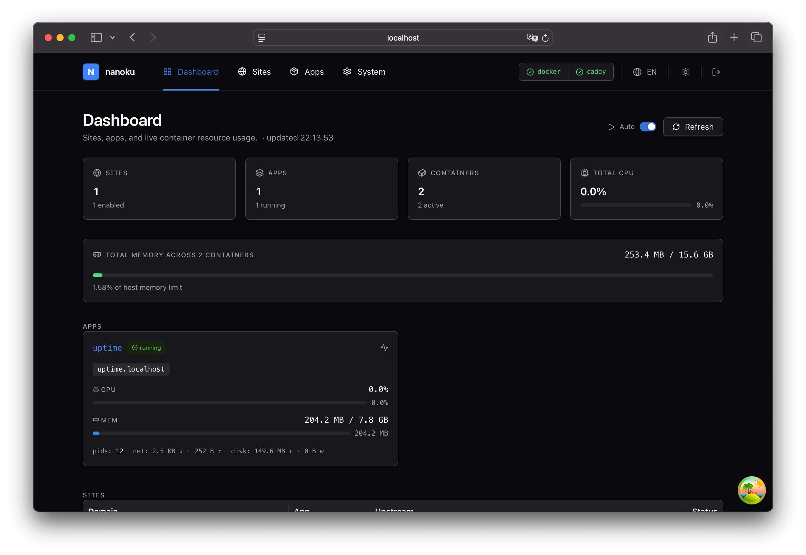
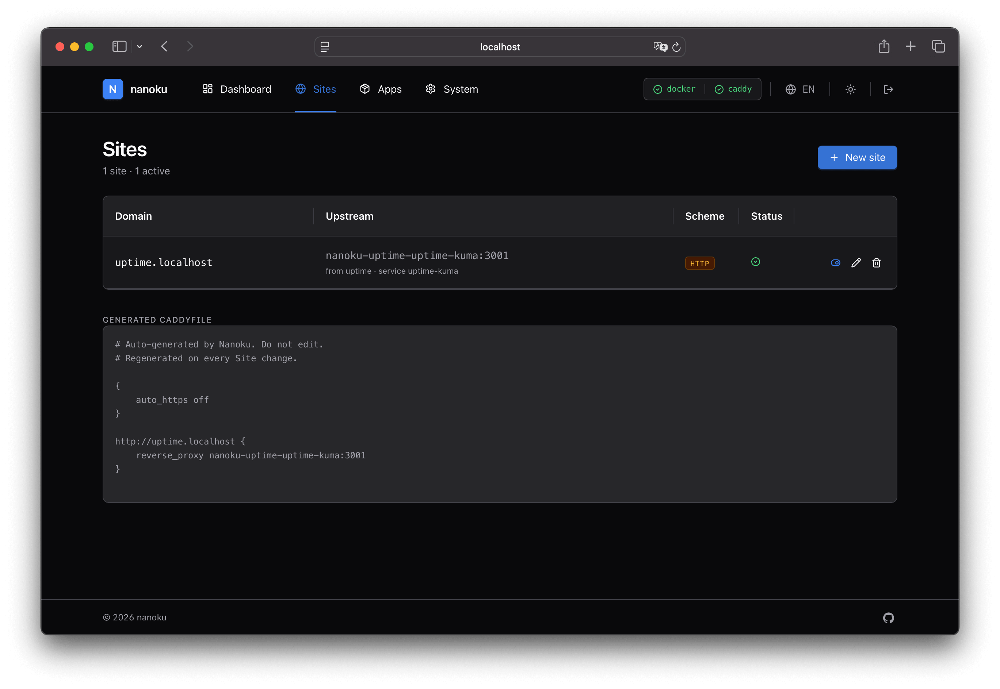
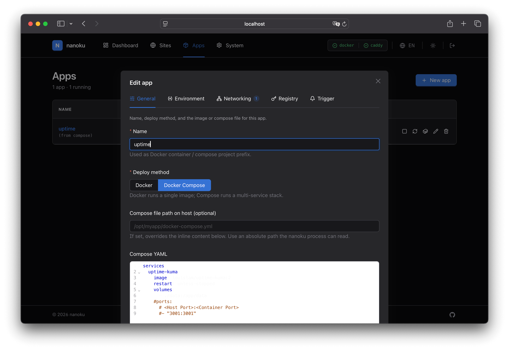
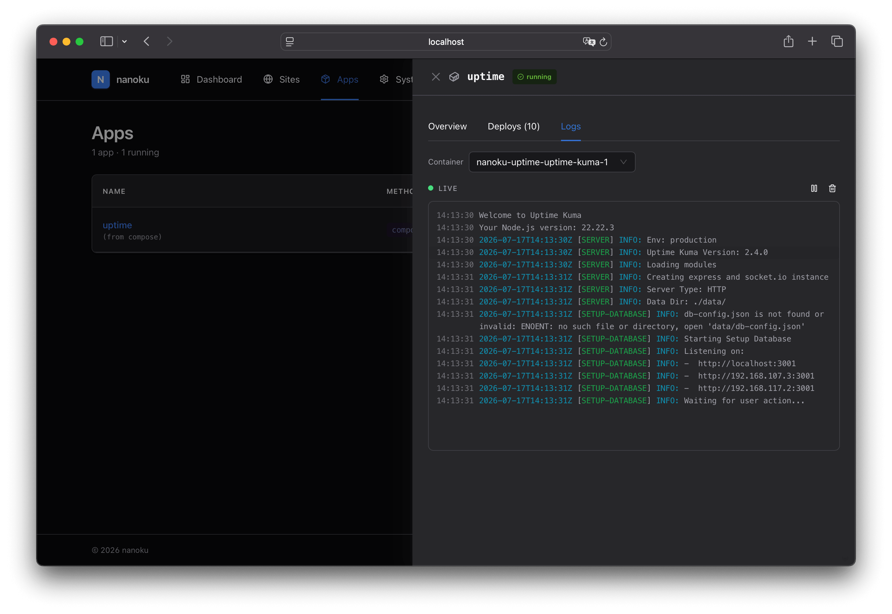

# Nanoku

> **The nano Heroku / Vercel for your own server.**

A single Go binary with an embedded React admin UI. Your CI (GitHub
Actions, GitLab CI, Drone, …) builds the Docker image, pushes it
to your registry, and POSTs the nanoku trigger endpoint — which
pulls, swaps the container, and reloads Caddy for HTTPS. "git push
→ deployed", on your own machine.

## 📸 Preview

<table>
  <tr>
    <td width="50%"><br /><sub align="center"><b>Dashboard</b> — sites, apps, live CPU / memory across all containers</sub></td>
    <td width="50%"><br /><sub align="center"><b>Sites</b> — domain → upstream routing, auto-generated Caddyfile</sub></td>
  </tr>
  <tr>
    <td width="50%"><br /><sub align="center"><b>Apps editor</b> — Docker or Docker Compose, env, registry, trigger token</sub></td>
    <td width="50%"><br /><sub align="center"><b>Live logs</b> — SSE-streamed deploy / app / system logs</sub></td>
  </tr>
</table>

## ✨ Features

- **Single binary** — Go server + embedded React admin UI in one executable
- **SQLite powered** — zero external database; state lives in a single file
- **HTTP-trigger deploys** — provider-agnostic: works with GitHub Actions,
  GitLab CI, Drone, or any system that can POST JSON
- **Docker & Docker Compose apps** — single-image apps or multi-service
  compose stacks side by side
- **Caddy integration** — managed Caddy container, automatic Caddyfile
  regeneration, ACME / Let's Encrypt TLS out of the box
- **Sites & domains** — one domain = one upstream; sites can be linked
  to an app (auto-resolved) or stand alone with a placeholder upstream
- **Per-app secrets** — env vars, registry credentials, and trigger
  tokens are AES-256-GCM encrypted at rest
- **Private registry support** — `docker login` on demand with logout
  after pull, no lingering credentials
- **Live log streaming** — SSE-powered real-time deploy / app / system
  logs in the UI
- **Dashboard** — aggregated resource view (CPU, memory, network) across
  all running containers
- **System tools** — orphan container reconcile, nanoku/Caddy log view
- **Session auth** — HttpOnly cookies, sliding 7-day TTL, login
  rate-limited per IP
- **Bilingual UI** — English & 简体中文
- **Tiny footprint** — runs comfortably on a $5 VPS
- **Health endpoint** — `/healthz` for orchestrators and load balancers
- **Multi-arch** — linux/amd64, linux/arm64, darwin/amd64, darwin/arm64,
  windows/amd64

## 🧭 Philosophy

Coolify and Dokploy are great, but sometimes you just want something
**truly lightweight**. nanoku is the nano version: pull images, swap
containers, reload the proxy, stream logs. Nothing more.

What nanoku **doesn't** do (and why):

- **No build server.** Builds belong in your CI — GitHub Actions,
  GitLab CI, Drone, or any system that can push an image. nanoku only
  pulls. This is the single biggest size reduction vs. Coolify / Dokploy.
- **No template marketplace.** Coolify ships 300+ one-click apps;
  nanoku treats every deployment as "point at an image you built."
- **No multi-server / swarm.** nanoku runs on one host. Scale that host,
  not the control plane.
- **No Cloud / SaaS tier.** Self-hosted only, by design.

If you need any of those, Coolify / Dokploy are the right call.
If you don't, nanoku is a single binary and a single SQLite file.

## 🚀 Quick Start

### Install with one command (recommended)

The installer pulls the latest image, writes `/etc/nanoku/`, generates
a fresh `NANOKU_SECRET_KEY` + admin password, drops a systemd unit,
starts nanoku, and prints the access URL.

```bash
curl -fsSL https://raw.githubusercontent.com/isaced/nanoku/main/scripts/install.sh | sudo bash
```

Useful overrides:

| Variable                   | Default       | Notes                                                  |
| -------------------------- | ------------- | ------------------------------------------------------ |
| `NANOKU_VERSION`           | `latest`      | Pin a specific tag, e.g. `v0.1.0`                      |
| `NANOKU_ADMIN_USER`        | `admin`       | Seed admin username                                    |
| `NANOKU_ADMIN_PASSWORD`    | *(generated)* | Set your own to skip the one-time print at the end     |
| `NANOKU_SECRET_KEY`        | *(generated)* | AES-256-GCM passphrase; **back up** after install      |
| `NANOKU_LISTEN`            | `:8080`       | nanoku UI listen address                               |
| `NANOKU_IMAGE_REGISTRY`    | `dockerhub`   | `ghcr` → `ghcr.io/isaced/nanoku`; `cnb` → `docker.cnb.cool/isaced/nanoku` |

After install:

```bash
# Upgrade
sudo /etc/nanoku/upgrade.sh

# Tail logs
journalctl -u nanoku -f

# Uninstall (keeps data)
sudo bash scripts/uninstall.sh
# or wipe everything
sudo bash scripts/uninstall.sh --purge
```

### Download a static binary (alternative)

If you'd rather skip Docker for nanoku itself, grab a single binary.
Note: this still requires Docker on the host — nanoku manages
containers, so the docker socket must be reachable via `DOCKER_HOST`
(defaults to `/var/run/docker.sock`).

```bash
# Grab the latest release
curl -L -o nanoku https://github.com/isaced/nanoku/releases/latest/download/nanoku_$(uname -s)_$(uname -m | sed 's/x86_64/amd64/;s/aarch64/arm64/').tar.gz
tar -xzf nanoku*.tar.gz
chmod +x nanoku

# Generate a secret key
export NANOKU_SECRET_KEY=$(openssl rand -base64 32)

# Required on first boot only
export NANOKU_ADMIN_USER=admin
export NANOKU_ADMIN_PASSWORD=changeme

./nanoku
```

Or grab a specific asset from the
[Releases page](https://github.com/isaced/nanoku/releases/latest).
You'll need to wire up your own systemd unit / launchd plist if you
want auto-start on boot.

### `docker compose` from source (alternative)

For development or if you prefer to run from a local checkout:

```bash
git clone https://github.com/isaced/nanoku.git
cd nanoku
cp .env.example .env
# Edit .env — set NANOKU_ADMIN_PASSWORD and NANOKU_SECRET_KEY at minimum
docker compose up -d
```

The image is multi-arch (`linux/amd64`, `linux/arm64`) and is published
to both Docker Hub and GHCR on every release tag.

### First boot

1. Open `http://<host>:8080` and log in with the admin credentials.
   The seed only runs on a fresh DB; change the password from the UI
   afterwards.
   - **Installer path** — credentials are at `/etc/nanoku/.env`
     (`NANOKU_ADMIN_USER` / `NANOKU_ADMIN_PASSWORD`). The installer
     prints them at the end of its run.
   - **Static binary / `docker compose` path** — credentials live in
     the `.env` file you prepared before first start.
2. nanoku auto-creates its managed Caddy container (`nanoku-caddy`) on
   first start. Sites served through Caddy will get automatic HTTPS
   via Let's Encrypt once a domain is pointed at the host. To enable
   auto-HTTPS, set `NANOKU_CADDY_AUTO_HTTPS=true` in the same `.env`
   file and restart nanoku (`sudo systemctl restart nanoku` for the
   installer path, `docker compose restart` otherwise).
3. `NANOKU_SECRET_KEY` is **required** — it derives the AES-256-GCM
   key that encrypts registry passwords, trigger tokens, and env var
   values at rest. Lost key = permanently lost secrets.

## 🖥️ Admin UI

The embedded SPA is built with React 19, Vite, TanStack Router, Ant
Design, and Tailwind 4. All routes are session-authenticated (except
`/login` and the HTTP trigger endpoint).

| Page        | What it does                                                       |
| ----------- | ------------------------------------------------------------------ |
| `/sites`    | Manage domains: one domain = one upstream; link to an app or stand alone |
| `/apps`     | Create / edit apps, configure deploys, rotate trigger tokens      |
| `/dashboard`| Aggregate view: sites, running apps, live container stats (CPU/mem) |
| `/system`   | Caddy / nanoku logs, orphan container reconcile, version info     |
| `/login`    | Admin sign-in                                                      |

The app editor is tabbed: **General · Environment · Volumes · Network
(exposed ports) · Registry · Trigger**. Switch an app between `Docker`
and `Docker Compose` deploy methods with a single toggle.

## 🐳 Apps: Docker vs Docker Compose

Each app runs in one of two modes:

- **Docker** — single image, single container. Set the image repo, the
  port to expose, and you're done. The current container is recorded
  in the DB; sites auto-resolve `<current_container>:<port>`.
- **Docker Compose** — paste compose YAML inline or point at a path
  on disk. Declare the **exposed services** you want Caddy to reach
  (with port numbers) and sites can target any of them.

On deploy, nanoku:

1. Logs into the registry if credentials are configured
2. Pulls the new image (or runs `docker compose pull`)
3. Stops the old container / stack
4. Starts the new one
5. Validates that every exposed service is actually running
6. Regenerates the Caddyfile and reloads Caddy
7. Streams the full log to the deploy record (and to your browser via SSE)

A single `DeployLock` enforces one deploy per app at a time — calling
the trigger while a deploy is running returns `409 Conflict`.

## 🌐 HTTP Trigger

Nanoku doesn't build your code. It pulls pre-built images. The build
runs in **your** CI; nanoku just exposes a small endpoint that fires
off a deploy when called.

### Protocol

```http
POST /api/apps/{name}/trigger
Authorization: Bearer <token>
Content-Type: application/json

{"tag": "v1.2.3", "commit_message": "fix: ..."}
```

- `{name}` is the app's DNS-1123 name (set on create)
- `<token>` is the per-app bearer token, shown **once** when you
  enable the trigger in the editor (or via
  `POST /api/apps/{id}/rotate-trigger-token`)
- The `tag` becomes the image tag; nanoku pulls
  `<app.image repo part>:<tag>`
- `202 Accepted` with the new deploy id, or `409` if a deploy for that
  app is already running
- Tokens are compared with `crypto/subtle.ConstantTimeCompare` —
  exact matches only, no prefix / suffix tricks

### Setup

1. In the app editor, tick **Enable HTTP trigger**. Save the token
   shown in the popup — you won't see it again.
2. In your CI, set two env vars:
   - `NANOKU_TRIGGER_URL`: `https://your-nanoku/api/apps/<name>/trigger`
   - `NANOKU_TRIGGER_TOKEN`: the token from step 1
3. Build & push your image, then POST the URL with the token.

### GitHub Actions example

Drop this into your app repo at `.github/workflows/deploy.yml`:

```yaml
name: deploy
on:
  push:
    branches: [main]

jobs:
  build:
    runs-on: ubuntu-latest
    permissions:
      contents: read
      packages: write
    steps:
      - uses: actions/checkout@v4
      - uses: docker/setup-buildx-action@v3
      - uses: docker/login-action@v3
        with:
          registry: ghcr.io
          username: ${{ github.actor }}
          password: ${{ secrets.GITHUB_TOKEN }}
      - uses: docker/build-push-action@v5
        with:
          push: true
          tags: ghcr.io/${{ github.repository_owner }}/${{ github.event.repository.name }}:${{ github.sha }}
      - name: Notify Nanoku
        env:
          URL: ${{ vars.NANOKU_TRIGGER_URL }}
          TOKEN: ${{ vars.NANOKU_TRIGGER_TOKEN }}
          SHA: ${{ github.sha }}
          MSG: ${{ github.event.head_commit.message }}
        run: |
          BODY=$(jq -nc --arg t "$SHA" --arg m "$MSG" '{tag: $t, commit_message: $m}')
          curl -fsS -X POST "$URL" \
            -H "Authorization: Bearer $TOKEN" \
            -H "Content-Type: application/json" \
            -d "$BODY"
```

### Generic shell (any CI / local)

```bash
BODY='{"tag":"v1.2.3","commit_message":"fix: ..."}'
curl -fsS -X POST "$NANOKU_TRIGGER_URL" \
  -H "Authorization: Bearer $NANOKU_TRIGGER_TOKEN" \
  -H "Content-Type: application/json" \
  -d "$BODY"
```

### Private registries

Add matching registry credentials in the app editor (Registry URL +
username + password). The trigger worker logs into the registry before
pull and logs out after, so credentials don't linger in
`~/.docker/config.json`.

## ⚙️ Configuration

Everything is configured through `NANOKU_*` environment variables
(or command-line flags — see `nanoku --help`).

| Variable                      | Flag                  | Default                       | Description                                                                  |
| ----------------------------- | --------------------- | ----------------------------- | ---------------------------------------------------------------------------- |
| `NANOKU_LISTEN`               | `--listen`            | `:8080`                       | HTTP listen address                                                          |
| `NANOKU_DB`                   | `--db`                | `./nanoku.db`                 | SQLite database file path                                                    |
| `NANOKU_CADDYFILE`            | `--caddyfile`         | `./Caddyfile`                 | Generated Caddyfile path (host filesystem)                                   |
| `NANOKU_CADDY_MODE`           | —                     | `managed`                     | Caddy integration mode (only `managed` is supported)                         |
| `NANOKU_CADDY_IMAGE`          | —                     | `caddy:2`                     | Caddy image used by the managed container                                    |
| `NANOKU_CADDY_CONTAINER`      | —                     | `nanoku-caddy`                | Managed Caddy container name                                                 |
| `NANOKU_CADDY_VOLUME`         | —                     | `nanoku-caddy-data`           | Caddy data volume name                                                       |
| `NANOKU_CADDY_NETWORK`        | —                     | `nanoku-net`                  | Docker network the managed Caddy and app containers share                    |
| `NANOKU_ACME_EMAIL`           | —                     | *(empty)*                     | Email for Let's Encrypt registration                                         |
| `NANOKU_COMPOSE_DIR`          | —                     | `./composes`                  | Where nanoku stores generated `docker-compose.yml` files                     |
| `NANOKU_DEPLOY_LOG_DIR`       | —                     | `./data/deploy-logs`          | Where per-deploy log files live                                              |
| `NANOKU_KEEP_DEPLOY_DAYS`     | —                     | `30`                          | Days of history kept by the background Janitor (deploy log files + retired containers) |
| `NANOKU_SELF_CONTAINER`       | —                     | *(empty)*                     | nanoku's own container name (enables the "self log" view in `/system`)       |
| `NANOKU_ADMIN_USER`           | —                     | `admin`                       | Seed admin username on a **fresh** DB; ignored after first boot              |
| `NANOKU_ADMIN_PASSWORD`       | —                     | *(empty)*                     | Seed admin password; **required** on first boot                              |
| `NANOKU_SECRET_KEY`           | —                     | *(empty)*                     | **Required.** Passphrase for the AES-256-GCM key (generate with `openssl rand -base64 32`) |
| `NANOKU_CADDY_AUTO_HTTPS`     | —                     | *(empty)*                     | Set to `true` for Caddy auto-HTTPS in production                             |
| `NANOKU_TRUST_PROXY`          | —                     | `false`                       | Honor `X-Forwarded-For` for client IP. Enable **only** behind a trusted proxy |
| `DOCKER_HOST`                 | —                     | `unix:///var/run/docker.sock` | Docker daemon socket                                                         |
| —                             | `--skip-caddy-reload` | `false`                       | Write Caddyfile but don't manage the Caddy container                         |

> 💡 Lost `NANOKU_SECRET_KEY` = permanently lost secrets. The key is
> not stored anywhere except the env you set it in. There is no
> rotation tool yet — back it up.

## 🛠️ Development

```bash
# Requirements: Go 1.26+, Node 20+
go mod download
cd ui && npm ci && cd ..

# Run the stack: Go on :8080, UI dev server on :3000 (HMR)
make dev

# Build everything (UI + Go) into bin/nanoku
make build

# Run all tests
go test -race -count=1 ./...
cd ui && npm test
```

> Local `go test` will fail to compile unless `internal/api/dist`
> exists (it's `go:embed`'d). Run `cd ui && npm run build` (or
> `make build-ui`) first. `make dev` and `make build` both do this
> for you.

See [`AGENTS.md`](./AGENTS.md) for the full project layout, code style,
and testing conventions.

## 🧹 Background cleanup

A built-in **Janitor** runs a fixed set of periodic tasks on a single
1-minute master ticker. The goal is bounded growth: deploy log files,
expired sessions, and retired container rows don't pile up forever.

| Task                       | Default interval | What it does                                                                |
| -------------------------- | ---------------- | ---------------------------------------------------------------------------- |
| `purge-expired-sessions`   | 1h               | Delete `sessions` rows past their absolute expiry                            |
| `purge-stale-attempts`     | 5m               | Drop empty per-IP login-attempt windows from the in-memory map               |
| `prune-orphan-log-files`   | 1h               | Delete `<id>.log` files for deploy rows that no longer exist                |
| `prune-old-log-files`      | 6h               | Delete deploy log files older than `NANOKU_KEEP_DEPLOY_DAYS` (deploy row is kept as history) |
| `prune-old-containers`     | 24h              | Delete `Container` rows in terminal states (exited/dead/retired) older than `NANOKU_KEEP_DEPLOY_DAYS` that aren't any app's `current_container` |

Every task runs once at boot (so a long-idle install doesn't have to
wait the first interval) and then on its own cadence. Each task has a
per-task timeout and panic isolation — a stuck or buggy cleanup
can't crash the process. Per-task status (last run, error, counts) is
exposed at `GET /api/system/cleanup` and rendered as a table on the
**System** page.

## 🔐 Security

- **`NANOKU_SECRET_KEY` is required** — nanoku refuses to boot without
  it. It derives the AES-256-GCM key that encrypts
  `registry_password`, `trigger_token`, and `envvar.value` at rest.
- **Per-app trigger tokens** are single-shot returned only on
  Create / Rotate, never on List / Get.
- **`registry_password` is passed to `docker login --password-stdin`**
  (never via argv). The worker logs out after the pull.
- **Login is rate-limited per IP** (`5/min`). Only honor
  `X-Forwarded-For` when you sit behind a trusted proxy that
  sanitizes the header (set `NANOKU_TRUST_PROXY=true`).
- **Session cookies** are `HttpOnly`, `SameSite=Strict`,
  `Secure` (when TLS). Sessions are stored SHA-256-hashed; the raw
  token only ever lives in the cookie. TTL 7 days, sliding renewal.
- **CORS allows `Origin: *`** for the trigger endpoint (CI calls
  are cross-origin). Session cookies are `SameSite=Strict` so they
  won't ride along cross-site.
- **Treat the host as trusted** — nanoku talks to
  `/var/run/docker.sock`. Anyone who can call the admin API can
  spawn containers on the host.

## 📚 Project Layout

- `main.go` — entry point: config, DB open + migrate, Caddy ensure,
  session store, HTTP wiring, graceful shutdown
- `internal/api/` — HTTP handlers, routing, session auth, deploy lock,
  embedded UI
- `internal/db/` — ent ORM schema + generated code
- `internal/secret/` — AES-256-GCM sealer
- `internal/caddy/` — Caddyfile writer / renderer
- `internal/config/` — env-based config loading
- `internal/docker/` — Docker manager (Caddy lifecycle, image pulls,
  container stats, log streaming)
- `ui/` — React 19 + Vite 8 + TanStack Router + Ant Design + Tailwind 4
- `composes/` — example compose apps used by the Docker Compose deploy path
- `scripts/` — install / upgrade / uninstall shell scripts (one-line installer, systemd-backed)
- `docs/` — design records (proposals, schema, reviews)

## 🤝 Contributing

PRs welcome. Conventional commits enforced (see `AGENTS.md` for the
full list and changelog rules). Branch from `main`; `test.yml` must
be green before review.

```bash
# Before opening a PR
go test -race -count=1 ./...
cd ui && npm test
```

## 📄 License

Released under the MIT License. See [`LICENSE`](./LICENSE).
