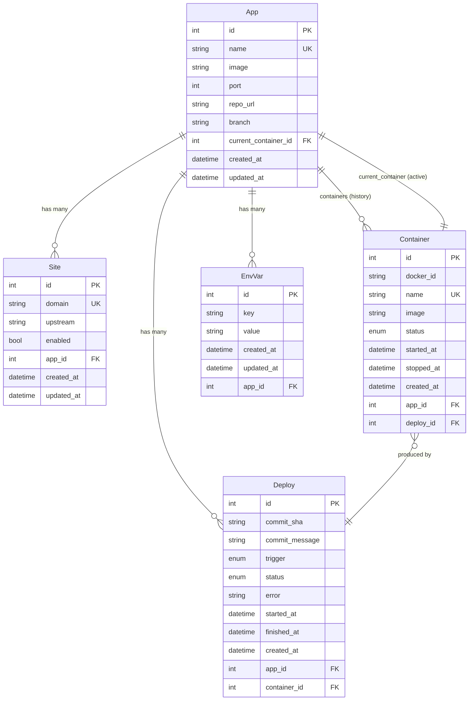

# Nanoku Schema Design (ent)

## Scope

设计覆盖 v0 + v1。v0 只实体化 `Site` 表；其他表（`App`/`Container`/`Deploy`/`EnvVar`）schema 文件先写好，**v1 启用迁移时再 materialize**。

| 阶段 | 表 |
|---|---|
| v0 | `Site` |
| v1 | `App`, `Container`, `Deploy`, `EnvVar` |
| v2+ (不在本设计) | `Repo`, `WebhookEvent`, `Build`, `User`, `AuditLog` |

## ER 图



## 迁移方案

**ent + Atlas** 声明式 schema diff：

- ent 生成 client 代码（`go generate ./ent`）
- Atlas 读 ent schema + 当前 DB state → 生成 diff SQL
- 启动时自动跑 pending migrations

工具链：

```bash
# 1. 装 Atlas
brew install ariga/tap/atlas

# 2. 启动时自动 diff + apply（开发）
atlas migrate apply --url file:nanoku.db?cache=shared

# 3. 生产环境用 versioned migrations
atlas migrate diff add_apps \
  --to "ent://internal/db/schema" \
  --dev-url "docker://postgres/..."  # 或 sqlite
```

v0 只 apply `Site` 表的 init migration。v1 加 `App` 等表时新建一个 migration 文件，CI 自动跑。

---

## ent schema 代码

### Mixin: 时间戳

`internal/db/schema/mixin.go`

```go
package schema

import (
    "time"
    "entgo.io/ent"
    "entgo.io/ent/schema/field"
    "entgo.io/ent/schema/mixin"
)

type TimeMixin struct {
    mixin.Schema
}

func (TimeMixin) Fields() []ent.Field {
    return []ent.Field{
        field.Time("created_at").
            Default(time.Now).
            Immutable(),
        field.Time("updated_at").
            Default(time.Now).
            UpdateDefault(time.Now),
    }
}
```

### Site (v0)

`internal/db/schema/site.go`

```go
package schema

import (
    "entgo.io/ent"
    "entgo.io/ent/schema/edge"
    "entgo.io/ent/schema/field"
)

type Site struct{ ent.Schema }

func (Site) Mixin() []ent.Mixin {
    return []ent.Mixin{TimeMixin{}}
}

func (Site) Fields() []ent.Field {
    return []ent.Field{
        field.String("domain").
            Unique().
            Comment("Public domain (e.g. api.example.com). Wildcards not supported."),
        field.String("upstream").
            Comment("Upstream URL or host:port. For v1 managed apps, auto-derived from App.current_container."),
        field.Bool("enabled").
            Default(true).
            Comment("When false, omitted from generated Caddyfile."),
    }
}

func (Site) Edges() []ent.Edge {
    return []ent.Edge{
        edge.From("app", App.Type).
            Ref("sites").
            Unique().
            Comment("Optional managed app this site proxies to. v1+."),
    }
}

func (Site) Indexes() []ent.Index {
    return []ent.Index{
        index.Fields("enabled"),
    }
}
```

### App (v1)

`internal/db/schema/app.go`

```go
package schema

import (
    "regexp"
    "errors"
    "entgo.io/ent"
    "entgo.io/ent/schema/edge"
    "entgo.io/ent/schema/field"
)

type App struct{ ent.Schema }

func (App) Mixin() []ent.Mixin {
    return []ent.Mixin{TimeMixin{}}
}

func (App) Fields() []ent.Field {
    return []ent.Field{
        field.String("name").
            Unique().
            Match(regexp.MustCompile(`^[a-z][a-z0-9-]{0,62}$`)).
            Comment("Unique app name (DNS-1123 label). Used as Docker container prefix."),
        field.String("image").
            Comment("Docker image, e.g. nginx:1.27 or ghcr.io/me/app:v1.2.3."),
        field.Int("port").
            Min(1).Max(65535).
            Comment("Internal port the app listens on inside its container."),
        field.String("repo_url").
            Optional().
            Nillable().
            Comment("Git repo URL for future webhook-driven deploys."),
        field.String("branch").
            Default("main").
            Comment("Branch to track for webhook deploys."),
        field.Int("current_container_id").
            Optional().
            Nillable().
            Comment("FK to the container currently serving traffic."),
    }
}

func (App) Edges() []ent.Edge {
    return []ent.Edge{
        edge.To("sites", Site.Type),
        edge.To("containers", Container.Type),
        edge.To("deploys", Deploy.Type),
        edge.To("env_vars", EnvVar.Type),
        edge.From("current_container", Container.Type).
            Ref("current_for").
            Unique(),
    }
}
```

### Container (v1)

`internal/db/schema/container.go`

```go
package schema

import (
    "entgo.io/ent"
    "entgo.io/ent/schema/edge"
    "entgo.io/ent/schema/field"
)

type Container struct{ ent.Schema }

func (Container) Mixin() []ent.Mixin {
    return []ent.Mixin{TimeMixin{}}
}

func (Container) Fields() []ent.Field {
    return []ent.Field{
        field.String("docker_id").
            Comment("Docker container ID (full SHA256)."),
        field.String("name").
            Unique().
            Comment("Container name, e.g. nanoku-myapp-a1b2c3."),
        field.String("image").
            Comment("Resolved image reference (may differ from App.image if pinned)."),
        field.Enum("status").
            Values("created", "running", "paused", "restarting", "removing", "exited", "dead").
            Comment("Last observed Docker state."),
        field.Time("started_at").
            Optional().Nillable(),
        field.Time("stopped_at").
            Optional().Nillable(),
    }
}

func (Container) Edges() []ent.Edge {
    return []ent.Edge{
        edge.From("app", App.Type).
            Ref("containers").
            Unique(),
        edge.From("deploy", Deploy.Type).
            Ref("container").
            Unique().
            Comment("The deploy that produced this container."),
        edge.From("current_for", App.Type).
            Ref("current_container").
            Unique().
            Comment("Inverse of App.current_container (zero or one)."),
    }
}

func (Container) Indexes() []ent.Index {
    return []ent.Index{
        index.Fields("status"),
    }
}
```

### Deploy (v1)

`internal/db/schema/deploy.go`

```go
package schema

import (
    "entgo.io/ent"
    "entgo.io/ent/schema/edge"
    "entgo.io/ent/schema/field"
)

type Deploy struct{ ent.Schema }

func (Deploy) Mixin() []ent.Mixin {
    return []ent.Mixin{TimeMixin{}}
}

func (Deploy) Fields() []ent.Field {
    return []ent.Field{
        field.String("commit_sha").
            Optional().Nillable().
            Comment("Git commit SHA. Optional for manual deploys."),
        field.String("commit_message").
            Optional().Nillable(),
        field.Enum("trigger").
            Values("manual", "webhook").
            Default("manual"),
        field.Enum("status").
            Values("pending", "running", "success", "failed", "rolled_back").
            Default("pending"),
        field.String("error").
            Optional().Nillable().
            Comment("Failure reason when status=failed."),
        field.Time("started_at").
            Optional().Nillable(),
        field.Time("finished_at").
            Optional().Nillable(),
    }
}

func (Deploy) Edges() []ent.Edge {
    return []ent.Edge{
        edge.From("app", App.Type).
            Ref("deploys").
            Unique(),
        edge.To("container", Container.Type).
            Unique().
            Comment("Container produced by this deploy (set on success)."),
    }
}

func (Deploy) Indexes() []ent.Index {
    return []ent.Index{
        index.Fields("status"),
        index.Fields("created_at"),
    }
}
```

### EnvVar (v1)

`internal/db/schema/envvar.go`

```go
package schema

import (
    "entgo.io/ent"
    "entgo.io/ent/schema/edge"
    "entgo.io/ent/schema/field"
    "entgo.io/ent/schema/index"
)

type EnvVar struct{ ent.Schema }

func (EnvVar) Mixin() []ent.Mixin {
    return []ent.Mixin{TimeMixin{}}
}

func (EnvVar) Fields() []ent.Field {
    return []ent.Field{
        field.String("key").
            MaxLen(255).
            Comment("Env var name, e.g. DATABASE_URL."),
        field.String("value").
            Sensitive().
            Comment("Env var value. Plain text in v1; encryption in v2."),
    }
}

func (EnvVar) Edges() []ent.Edge {
    return []ent.Edge{
        edge.From("app", App.Type).
            Ref("env_vars").
            Unique(),
    }
}

func (EnvVar) Indexes() []ent.Index {
    return []ent.Index{
        index.Fields("app_id", "key").Unique(),
    }
}
```

---

## 关键决策

| 决策 | 选择 | 理由 |
|---|---|---|
| ORM | ent | 已确认。类型安全 + edge 模型贴合领域 |
| 迁移工具 | ent + Atlas（声明式 diff） | 比手撸 SQL 安全，比 GORM AutoMigrate 灵活 |
| 软删除 | 不做 | v0/v1 数据直接 hard delete；审计后置 |
| 审计日志 | 不做 | v2+ 按需 |
| EnvVar 加密 | v1 明文 + Sensitive() 标记 | v2 加密（passphrase from env） |
| App 多容器 | 单 current_container（无蓝绿） | v1 简化；多实例 v2 加 Edge |
| 历史容器保留 | 保留所有 | 便于 rollback 与 debug；清理策略 v2 |
| Deploy 关联 Container | 1:1（Deploy.container 唯一） | 一对一建模一个 deploy 产出一个 container |
| Site.upstream | 字符串，nullable 在 v1+ 可由 App 推导 | v0 不强绑 App |
| `current_container_id` | 显式 FK（不用 edge enum 标记） | 简单、查询清晰 |
| 时间戳 | TimeMixin 复用 | DRY |
| `name` 校验 | regex DNS-1123（ent Match） | 提前挡非法输入 |

## 假设 / 待你确认

1. **App.name 必须是 DNS-1123**（小写字母开头、`[a-z0-9-]{0,62}`）——因为直接拿来做 docker container prefix。
2. **App.port 是单个端口**——v1 一个 app 一个端口。多端口（grpc + http 分流）v2 加 `Port` 实体。
3. **App.current_container 是 0..1，不是 0..N**——v1 单实例。蓝绿/多副本 v2 改。
4. **历史 Container 不自动清理**——所有 deploy 留痕。手动删 or v2 加 retention 策略。
5. **EnvVar 明文存储**——v1 不加密。Sensitive() 只影响 log/dump 输出。
6. **Caddy 设置不进 DB**（ACME email 等）——保留 env var config。

OK 的话我直接把这些 schema 文件落到 `internal/db/schema/`，再 `go generate` 出 ent client，然后写 db wrapper。

要改的地方告诉我。